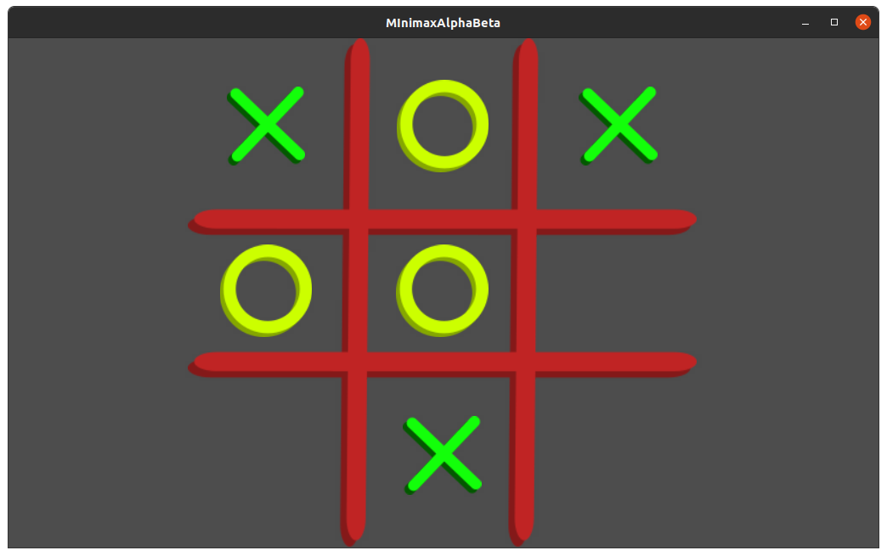
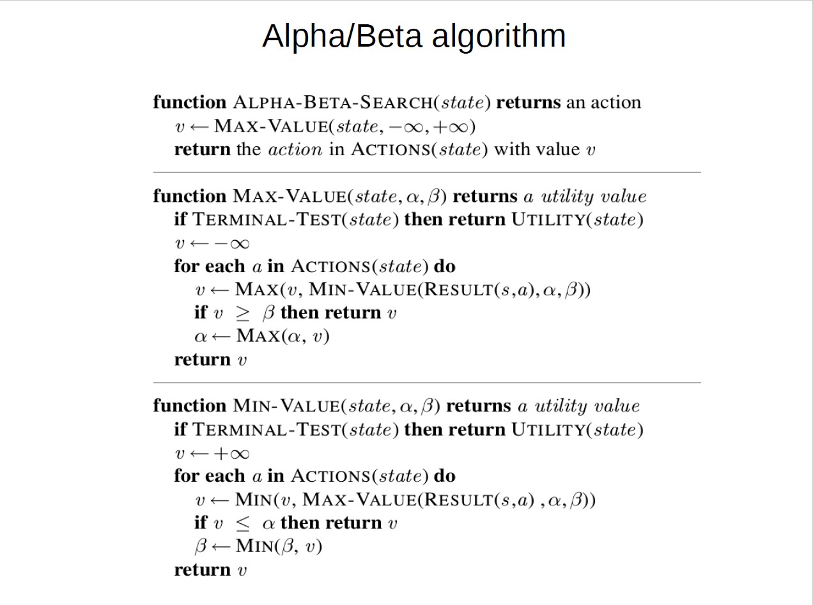
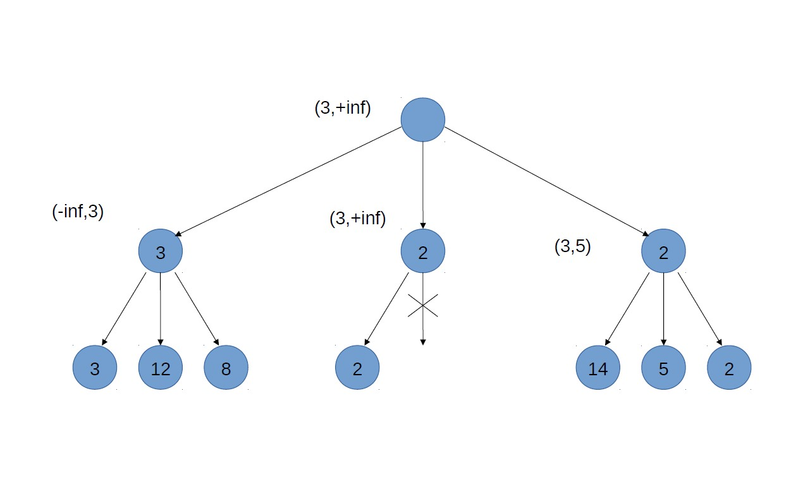

# Minimax with Alpha-Beta pruning

An implementation of the popular Tic Tac Toe game usig the AI Minimax algorithm with alpha-beta pruning.

The purpose of the project was to re-create the Minimax algorithm in GDScript to be used in Godot. The Alpha-Beta pruning was added for efficiency; more improvements maybe in the future.
A simple version of the Tic Tac Toe game was made to test the AI. The game can be played either against another player or against the AI

## Table of Contents

- [Minimax algorithm and Alpha-Beta pruning](#minimax-algorithm-and-alpha-beta-pruning)
    - [Pseudocode](#pseudocode)
    - [Example](#example)
- [Usage](#usage)
- [Contributing](#contributing)
- [License](#license)

## Minimax algorithm and Alpha-Beta pruning

> Minimax is a kind of backtracking algorithm that is used in decision making and game theory to find the optimal move for a player, assuming that your opponent also plays optimally. 
It is widely used in two player turn-based games such as Tic-Tac-Toe, Backgammon, Mancala, Chess, etc.

> In Minimax the two players are called maximizer and minimizer. 
The maximizer tries to get the highest score possible while the minimizer tries to do the opposite and get the lowest score possible.

> Every board state has a value associated with it. 
In a given state if the maximizer has upper hand then, the score of the board will tend to be some positive value. 
If the minimizer has the upper hand in that board state then it will tend to be some negative value. 
The values of the board are calculated by some heuristics which are unique for every type of game.

Explanation from Geeks for Geeks

### Pseudocode

### Example

## Usage

Simply clone this repo, import in Godot and run!
There is a starting menu from which you can choose whether to play against another player or against the computer.

The AI is an Autoload, you can copy and paste into your project and use it, but to be functional you have to implement in your project these methods:
- `is_game_over()`
- `make_move(cell: Area2D, is_player_x: bool, is_computer_turn: bool)` 
- `undo_move(cell: Area2D)`
- `get_score()`
- `get_empty_tiles()`

## Contributing

-  :fork_and_knife: Fork this repo 
-  :computer: Hack away
-  :wrench: Make a pull request 

Or just create an issue, they are welcome!

- :mag: Create an issue 

## License

This project is licensed under the MIT License. See the [LICENSE](LICENSE) file for details
